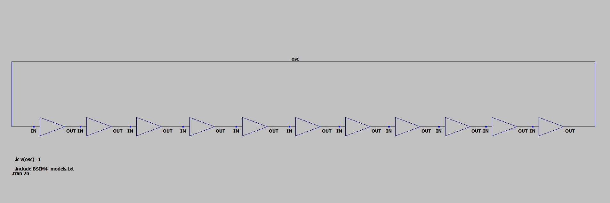
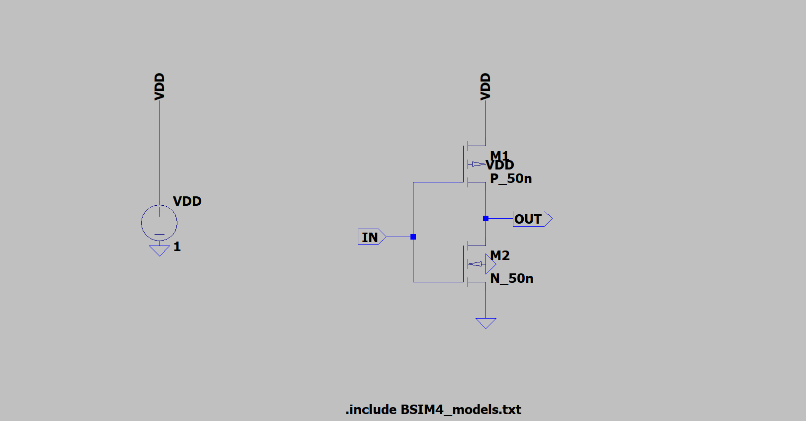
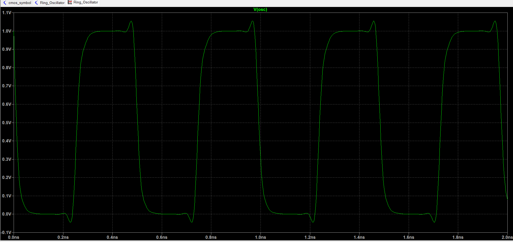

# Ring Oscillator Simulation

This repository contains the LTSpice simulation files for a **CMOS Ring Oscillator**, including circuit schematics, models, and simulation results.

## Project Structure

```
- circuits
  - Ring_Oscillator.asc           # LTSpice schematic for the CMOS Ring Oscillator circuit
  - Ring_Oscillator.net           # Netlist file for the ring oscillator circuit
  - Ring_Oscillator.raw           # Raw data file generated from the LTSpice simulation

- documentation
  - Ring_Oscillator_Report.md     # Detailed report of the design process, analysis, and simulation results

- models
  - BSIM4_models.txt              # BSIM4 model definitions for NMOS and PMOS transistors used in the design

- results
  - Ring_Oscillator.log           # Log file containing the results from the simulation
  - Ring_Oscillator.op.raw        # Operating point data file from the simulation

- screenshots
  - CMOS_Invertor_Circuit.png     # Screenshot of the CMOS inverter schematic
  - CMOS_ring_oscillator.png      # Screenshot of the full CMOS Ring Oscillator schematic
  - Oscillator_Waveform.png       # Screenshot of the simulation waveform for the oscillator
  - Ring_Oscillator_circuit.png  # Another screenshot of the ring oscillator circuit

- symbols
  - cmos_symbol.asc               # LTSpice symbol for the CMOS inverter
  - cmos_symbol.asy               # ASCII symbol for the CMOS inverter used in the schematic

- README.md                       # This file
```

## Overview
The **CMOS Ring Oscillator** is a fundamental digital circuit composed of an odd number of CMOS inverters connected in a loop. It generates an oscillating signal without any external clock input.

### Working Principle
- The inverters introduce a propagation delay that causes the signal to oscillate.
- The frequency of oscillation is determined by the number of inverters and their delay.
- The output is a periodic waveform with a frequency dependent on the supply voltage, process parameters, and circuit design.

## Files Description

### **Schematics and Symbols**
- **cmos_symbol.asc** → CMOS inverter schematic.
- **cmos_symbol.asy** → Symbol for the CMOS inverter.
- **Ring_Oscillator.asc** → Complete ring oscillator schematic in LTSpice.
- **Ring_Oscillator (netlist)** → Netlist for circuit simulation.

### **Simulation Results**
- **Ring_Oscillator.op** → Operating point analysis results.
- **Ring_Oscillator (raw png)** → Simulation waveforms and results.

### **Models**
- **BSIM4_models.txt** → Defines the PMOS and NMOS transistor models for accurate SPICE simulation.

### **Documentation**
- **Ring_Oscillator_Report.pdf** → Detailed explanation of the circuit and results.

## Simulation Images

### **Ring Oscillator Schematic**


### **CMOS Inverter Schematic**


### **Simulation Output Waveform**


## How to Run the Simulation
1. Open **LTSpice**.
2. Load the **Ring_Oscillator.asc** schematic.
3. Ensure that **BSIM4_models.txt** is included in the simulation.
4. Run the transient analysis to observe oscillations.
5. Analyze the waveform output to determine the oscillation frequency.

## Future Enhancements
- Implementing different CMOS process nodes to compare performance.
- Optimizing the delay by modifying the number of stages.
- Adding a buffer stage to improve output drive capability.

---